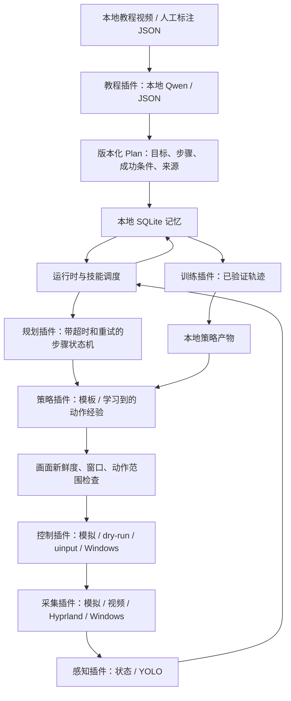

# 通用游戏代理架构 v0.1

本项目提供可扩展的执行框架。当前可验证能力是模拟游戏闭环执行、教程计划持久化、经验检索、动作经验学习与插件替换。真实游戏需要对应的可观察状态、键位配置和教程；框架自身没有预训练的跨游戏操作能力。

## 数据流

第一阶段另外提供 `download → 原视频与分类 → understand → 候选语义报告`，与下面的游戏 Plan/执行链独立。下载、语音、语义为三个新增可替换角色，原游戏角色接口兼容；详见 [第一阶段设计](video-stage1.md)。

双平台适配另增 `prepare-dataset → 复核标注 → build-dataset → detector_trainer.train` 离线链路。Linux 负责制作视频训练数据；Windows 的 `windows.capture` 与 `windows.controller` 替换桌面接口，核心数据协议保持 API v1。检测数据集 schema v1 独立于 Plan、动作经验和 SQLite；`experience.policy` 1.0.1 仅修正 UTF-8 加载，继续读取原 schema v1 产物。详见 [双平台工作流](windows-linux.md)。

教程理解在执行之前完成。运行循环不会逐帧调用大语言模型；它依据当前状态选择下一步，执行后必须看到条件成立。默认连续两帧满足条件才进入下一步。模型生成的计划只是一份候选，不会直接获得“已学会”状态。

## 可替换边界

| 角色 | 稳定方法 | 初始实现 | 替换示例 |
|---|---|---|---|
| tutorial | analyze(source) → Plan | annotated.tutorial、qwen-video.tutorial | 换视频理解模型 |
| capture | capture() → Frame | demo、video、hyprland、windows | 接入 PipeWire 原始帧 |
| perception | perceive(Frame) → State | facts、yolo | 接入 OCR、追踪或融合感知 |
| planner | decide(Plan, State, time) → Decision | sequential | 行为树、分层规划 |
| policy | choose(Step, State) → Action | template、experience | BC/时序策略、目标定位控制 |
| controller | execute(Action, State) → applied | demo、dry-run、uinput、windows | 手柄输入 |
| memory | remember / recall / begin / append / finish | sqlite | 向量检索或另一个数据库 |
| learner | train(examples, output) → report | action-memory | 神经网络模仿学习 |
| detector_trainer | train(dataset, output) → report | yolo.detector-trainer | 其他本地视觉训练后端 |

`contracts.py` 只定义数据和协议；`runtime.py` 只调用角色接口；`registry.py` 读取清单并延迟导入选中的实现。可选 GPU 库不进入基础依赖。每个插件声明 `API_VERSION`、`ROLE`、`VERSION` 并实现 `close()`；构造失败时资源须由该构造函数自己清理，成功构造的资源由运行时逆序关闭。

配置支持 `extends`，替换 `use` 时不继承旧插件的 `options`。`configs/learned-demo.toml` 是只替换策略的实例。支持新增外部插件清单；插件 Python 模块须能被当前解释器导入。清单是受信本地代码配置，不能来自教程视频中的指令。

更换插件在两次运行之间生效。当前不在动作执行中热卸载模型。每次运行保存插件版本、配置摘要和独立日志；保留旧插件版本及配置即可回滚。修改协议的含义时提高 API 版本，并提供迁移，不把兼容问题隐藏在核心的条件分支里。

## 坐标与动作

按钮目标使用 `target` 标签，在当前帧解析为窗口内归一化坐标；同名目标存在多个候选时停止并提示补充消歧逻辑。物理像素与 Hyprland 逻辑坐标通过窗口矩形换算。学习产物保存语义目标，不保存过期屏幕坐标。

动作 v1 支持短时单键、左键点击、相对鼠标移动和等待。动作持续时间由游戏配置限制，uinput 每次执行后释放按键。长时持续控制、组合键、手柄和高频 FPS 控制可通过扩展动作协议及策略实现；当前 demo 不证明具备这些能力。

`runtime.mode` 区分 simulation / replay / live；dry-run 是控制器的执行方式。录像源只允许 dry-run，不能作为当前实机状态来驱动输入。实机模式同时要求 `--live`、明确的窗口类别（Windows 也可按精确标题匹配）、当前焦点和稳定窗口身份/几何。Ctrl+C 或项目 `memory/STOP` 可停止动作，Windows 输入插件另检查 F12；删除 STOP 是用户重新启动的选择，程序不自动删除。

## 本地存储和记忆

SQLite schema v1 保存 `plans`、`runs`、`events`。教程按内容哈希去重，每次内容修改形成独立版本。WAL 支持读取和崩溃恢复；未知的较新 schema 会报错，不自动覆盖。未正常结束的 run 保留 running 状态，不能作为成功证据。

检索按 `game.id + game.version + game.profile` 隔离，成功次数另按 simulation/live 区分。更改键位、UI 语义或关键布局时更新 profile，游戏升级造成状态变化时更新 version。插件参数变化另有配置哈希供审计。

`memory/project.md` 保存开发者决策和验证事实；SQLite 保存程序学到的教程与执行经验；`.agents/skills/game-agent-gpt6` 指导 Codex 开发此项目。这三种内容各有用途，程序运行记录不会自动修改 Codex 指令，也不会训练 GPT-6 的模型权重。

## 当前性能边界

运行时是同步参考实现，记录真实 tick P95，不保证实机低于 30ms。它包括采集、感知、规划、动作执行等待和 SQLite 写入；之前的 YOLO 图片推理数字不能作为这条完整链路的性能。

Hyprland 后端每帧启动 grim，使用 PPM 避免 JPEG 编解码，仍存在进程启动、CPU 拷贝和桌面合成开销。需要达到更低延迟时，优先只替换 capture 为持久 PipeWire 流，再测量整体；随后可将日志写入移到有界队列。异步流水线必须保留时间戳、新鲜度检查、最新帧语义和丢帧统计。

## 现有方案取舍

预先查看了 [Cradle](https://github.com/BAAI-Agents/Cradle) 的通用计算机控制和技能管理思路，以及 [MineStudio](https://github.com/CraftJarvis/MineStudio) 的 Minecraft 开发框架。这里按用户要求保留独立的小型核心，复用 OpenCV、Ultralytics、Transformers 和 Linux 输入接口，避免把一个特定游戏框架的依赖引入所有插件。
