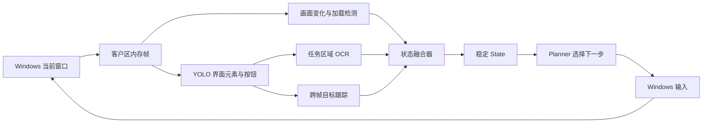

# 原神实时画面感知与 YOLO 训练方案

更新日期：2026-09-21。目标是在 Windows 当前游戏窗口中持续回答三个问题：**现在位于什么界面、当前有哪些可操作目标、上一步是否已经成功**。规划器只消费稳定的 `State`，不能直接根据一帧 YOLO 检测结果发送输入。

## 核心判断

YOLO 适合定位外观相对稳定的界面元素、按钮、图标和状态提示，不适合记住不断变化的任务名称、目标数量和长文本。实时感知因此分为四层：

1. `windows.capture` 取得带时间戳、窗口身份和焦点状态的客户区画面。
2. YOLO 定位界面锚点与可点击目标；OCR 只读取 YOLO 找到的任务和提示区域。
3. 状态融合器结合连续多帧、OCR 和允许的状态转移，产生稳定事实。
4. `sequential.planner` 根据前置条件选择动作，并在后置条件连续成立后推进步骤。



当前 `yolo.perception` 已能把检测类别写入 `State.facts`，并把归一化框写入 `State.targets`；当前规划器会对动作后置条件连续确认。下一阶段需要补的是 OCR、场景规则和进入/退出状态的跨帧迟滞，而不是把所有信息都训练成 YOLO 类别。

## 第一版视觉词表

先围绕“打开背包任务页，找到任务道具，使用并观察结果”形成一个可闭环的小模型。类别必须描述可以稳定框选的视觉对象，不使用具体任务名称作为类别。

| 类别 | 框选对象 | 用途 |
|---|---|---|
| `hud_minimap` | 左上角完整小地图 | 判断正常探索 HUD |
| `quest_tracker_region` | 屏幕左侧任务追踪文字块 | 提供 OCR 区域，不直接表示任务完成 |
| `interaction_prompt` | 可交互按键与文字提示整体 | 判断附近存在可交互对象 |
| `dialogue_box` | 对话正文区域 | 判断正在对话 |
| `dialogue_option` | 单个可选对话项 | 提供当前帧点击目标 |
| `inventory_panel` | 背包主面板的稳定外框或标题锚点 | 判断背包界面 |
| `quest_tab` | 背包中的任务页签 | 定位任务页签 |
| `quest_item_card` | 单个任务道具卡片 | 定位候选任务物品，名称由 OCR/人工 Plan 消歧 |
| `use_button` | 可用状态下的“使用”按钮 | 提供执行目标 |
| `confirm_button` | 通用确认按钮 | 提供执行目标，必须结合当前界面消歧 |
| `quest_complete_banner` | 任务完成横幅或稳定提示 | 形成完成状态候选 |
| `achievement_banner` | 成就弹出提示 | 验证成就事件，不等同于任务完成 |
| `loading_indicator` | 加载界面的稳定图标或区域 | 加载期间禁止输入 |

暂不把具体食物、角色、任务标题、数量和路线节点做成检测类别。这些内容变化快，应由 OCR、图标检索或后续游戏专用模型处理。多个外观差异很大的按钮也不要合并成一个没有上下文的 `button` 类别。

## 从检测结果生成状态

状态键保持可审计、可用于 Plan 前置和后置条件。第一版建议：

```json
{
  "screen.gameplay": true,
  "screen.inventory": false,
  "screen.dialogue": false,
  "screen.loading": false,
  "ui.quest_tab": false,
  "ui.use_button": false,
  "ui.interaction_prompt": true,
  "quest.tracker_visible": true,
  "quest.completed": false,
  "achievement.visible": false
}
```

`State.targets` 保存当前帧中的 `quest_tab`、`quest_item_card`、`use_button` 等归一化框。动态文字另保留 OCR 原文、规范化文本、置信度和来源帧；只有同一文本在连续观测中稳定，才映射为可供 Plan 使用的事实，例如 `quest.title` 或 `quest.progress`。

推荐状态规则：

- 出现 `inventory_panel` 才允许把 `screen.inventory` 设为真；仅检测到一个通用按钮不能判断界面。
- `hud_minimap` 存在且背包、地图、对话和加载锚点均不存在时，才判断 `screen.gameplay`。
- `loading_indicator` 一旦进入立即阻断输入，连续多帧消失后才退出加载状态。
- 按钮进入状态至少需要最近 3 帧中的 2 帧命中；退出状态需要连续 3 帧未命中，减少闪烁。
- 任务完成必须使用任务完成提示、任务追踪变化或明确的 Plan 后置条件；成就提示不能替代任务完成。
- 画面过期、窗口失焦、目标框来自旧帧或状态存在冲突时，输出未知/等待，不猜测下一步。

## 数据采集与标注

训练画面必须来自目标 Windows 配置：分辨率、UI 缩放、语言、窗口模式、游戏版本和按键 profile 都写入录制元数据。教程视频可以提供初始样本，但不能替代当前游戏窗口数据，因为视频会包含字幕、剪辑、压缩和不同 UI 配置。

每个类别至少覆盖以下变化：

- 目标出现、消失、被遮挡、动画进入和退出。
- 白天、夜晚、室内、室外、亮色和暗色背景。
- 可用、禁用、选中和未选中的按钮状态。
- 目标附近存在相似图标、字幕、水印或视频控件的负样本。
- 目标分辨率和 UI 缩放；不同 profile 不混成无法追踪来源的数据。

切分按录制会话执行，同一段连续录制及其相邻帧只能属于一个 train/val/test 集。验证集至少包含另一场独立录制，不能随机打散视频帧制造高分。先标注动作闭环真正依赖的类别，再补通用 UI；不追求一次标完所有原神界面。

## 训练和评估顺序

1. **状态词表冻结。** 固定类别含义、框选边界、游戏 build/profile 和数据 schema。
2. **独立录像。** Windows 录制首个任务的成功、失败、取消、加载和误触发场景。
3. **人工复核。** Linux 使用现有 `prepare-dataset → build-dataset → check-dataset` 链路；整帧复核后才能标为负样本。
4. **YOLO 基线。** 先训练 `yolo26n` 和 `yolo26s`，以独立集逐类别 precision/recall、漏检片段和端到端延迟筛选。
5. **状态回放。** 在整段验证录像上运行“检测 → OCR → 状态融合”，测量状态转移，而不只看单帧 mAP。
6. **Windows dry-run。** 实时显示当前稳定状态与候选目标，不发送输入；逐条核对状态变化。
7. **有限闭环。** 只开放一个经复核任务，输入后必须观察到后置条件；失败样本回流到独立待复核集。

单帧检测指标不足以决定能否操作。发布模型至少记录：每类 precision/recall、连续漏检最长时长、错误状态转移数、按钮目标中心误差、状态进入/退出延迟、端到端 P50/P95，以及数据、初始权重和结果权重哈希。

## 实时性能方案

Windows 采集帧直接以内存 BGR 图像传给模型，不经过 JPEG。主循环保留最新帧，旧帧允许丢弃；任何动作都必须引用当前窗口和足够新的状态。

- YOLO 可按 10–30 Hz 运行，具体频率由 Windows 实测延迟决定。
- OCR 不必逐帧运行，只在任务区域首次出现、区域内容明显变化或 Plan 请求文本事实时触发。
- 场景与按钮检测使用小模型常驻 GPU；OCR 和较重模型通过有界任务队列运行，过期结果直接丢弃。
- 状态融合器记录来源帧序号和时间戳；异步结果不得覆盖更新后的窗口状态。
- 2K 单图 P95 30 ms 仍是候选筛选目标，不等于完整采集、OCR、规划和输入闭环达到 30 ms。

## 最小交付顺序

第一批只实现以下闭环：

```text
gameplay
  → 打开背包
inventory
  → 进入 quest_tab
inventory.quest
  → 选择 quest_item_card
inventory.quest.item
  → 点击 use_button
gameplay / achievement.visible
  → 根据 Plan 的明确后置条件判断成功或继续等待
```

完成这条链路后，再增加地图、传送、对话选择、导航与战斗状态。每次扩展只增加必要的视觉词和状态转移，保持旧数据、模型与 Plan 可追踪并可回滚。

## 当前缺口

- 尚无目标 Windows 原神窗口的连续录制和同步窗口元数据。
- 教程基线已复核33张训练帧和19张独立验证帧，并完成 YOLO26n 训练；独立验证中小地图和交互提示召回为0，背包界面存在误报，尚不能用于实机决策。
- 当前 `yolo.perception` 是单帧检测，没有 OCR 与状态融合器。
- Windows 离线 CI 已通过，但未在真实游戏窗口测量采集、检测、状态转移或输入结果。

因此当前可以继续扩充目标 Windows profile 数据并实现离线状态回放；教程权重只用于数据链路和迁移验证，正式训练结论与实时性能必须等独立 Windows 录像和实机证据。执行记录见[YOLO 训练计划与进度](genshin-yolo-training-plan.md)。
