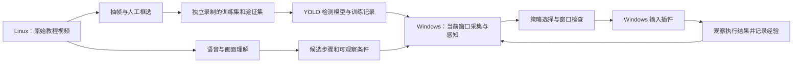

# Linux 制作训练数据，Windows 运行游戏

项目按同一套 Python 核心、可替换平台插件运行。Linux 负责下载、视频理解、抽帧、标注、离线训练和打包；Windows 负责读取当前游戏窗口、感知、决策、输入和结果验证。Windows 也能运行离线工具。当前开发环境是 Linux，所有桌面输入测试使用假设备；Windows 游戏实机尚未验收。



## Windows 安装和启动

目标环境为 Windows 10（1703 或以上）/11、64 位 Python 3.12。下载 [Miniforge Windows 安装程序](https://github.com/conda-forge/miniforge/releases/latest/download/Miniforge3-Windows-x86_64.exe)，安装到当前用户目录。项目可放在 `D:\work\yolo-ys` 这样的短路径。打开 Miniforge Prompt，进入解压后的项目根目录。

```text
conda create -n yolo26 python=3.12 -y
conda activate yolo26
```

先根据 Windows 显卡安装 PyTorch。NVIDIA CUDA 12.8 的示例命令如下；驱动与平台选项以 [PyTorch 官方安装选择器](https://pytorch.org/get-started/locally/) 为准。这里没有在 Windows 测过相应驱动。

```text
python -m pip install torch torchvision --index-url https://download.pytorch.org/whl/cu128
python tools/setup-project.py --profile windows
```

安装脚本只创建本项目 `.venv`，默认复用当前 Conda 的 PyTorch。`--profile core` 安装基础模拟框架，`video` 安装视频理解，`training` 安装视频理解和视觉训练，`all` 包含所有跨平台可选依赖；Linux 的 evdev 仍由 `.[linux]` 单独选择。不要把 Linux 的 `.venv` 或 Conda 环境复制到 Windows。

在 PowerShell/CMD 均可运行：

```text
tools\game-agent.cmd doctor
tools\game-agent.cmd demo
tools\game-agent.cmd train
tools\game-agent.cmd --config configs/learned-demo.toml demo
```

视频工具使用对应入口：

```text
python tools/setup-project.py --profile video
.venv\Scripts\python.exe tools/fetch-video-models.py
tools\youget.cmd "视频链接"
tools\video.cmd videos
tools\video.cmd understand 视频编号
```

下载、入库和语义理解还需要 `ffprobe`；安装 FFmpeg 并让其 `bin` 目录在当前终端的 PATH 中可见。可以在 Miniforge 环境中用 `conda install -c conda-forge ffmpeg` 安装。已有模型可直接复制到项目 `memory/models/`，无需重新下载。

Windows 的命令包装器切到项目根目录，并设置当前进程 UTF-8，不改变系统区域或 PowerShell 全局执行策略。Linux 现有 `tools/video`、`tools/youget` 继续可用；两端也能用 `python tools/video.py ...`。

## Windows 游戏窗口接入

先取得窗口信息，不发送输入。命令默认等待五秒，期间切换到游戏窗口：

```text
tools\game-agent.cmd windows-info --delay 5 --output memory/windows-preview.png
```

输出包含窗口 `class`、`title`、身份和客户区物理像素位置。截图仅用于确认采集区域。复制 `configs/windows.example.toml` 为 `configs/windows.local.toml`，填写：

- 实际游戏 `id`、`version`、键位/UI 的 `profile`。
- `plugins.capture.options.window_class` 或 `window_title` 的精确值。两者都填时同时匹配。
- 当前游戏检测模型的相对路径、设备、输入尺寸和类别映射。无 CUDA 时把 `device` 设为 `"cpu"`。
- 与检测输出匹配的、经过核对的 Plan。教程语义报告和 Plan 是不同格式。

保持示例里的 `dry-run.controller`，先检查定位与计划：

```text
tools\game-agent.cmd --config configs/windows.local.toml doctor
tools\game-agent.cmd --config configs/windows.local.toml run --plan memory/game-plan.json --live
```

这里的 `--live` 表示允许读取实时游戏模式；实际是否发送输入由 controller 选择决定。默认 dry-run 不发送按键，也不会把结果记成实机成功。

教程基线可以复制 `configs/genshin-windows.example.toml` 作为起点。它指向仓库内的 `models/genshin-ui-yolo26n-v1.pt`，但该权重跨视频验证未通过，只用于确认 Windows 能加载模型、读取窗口并显示候选框；不能作为开启真实输入的依据。

完成定位与成功条件检查后，将同一配置中的 controller 替换为：

```toml
[plugins.controller]
use = "windows.controller"
[plugins.controller.options]
window_class = "填写与 capture 相同的精确 class"
window_title = "填写与 capture 相同的精确 title"
```

只填写其中一个选择项时，删除另一个示例项或设为空。然后使用同一 `run ... --live` 命令。插件支持当前动作协议中的单键、左键点击、相对鼠标移动与等待。键位只能来自 `runtime.allowed_keys`，每次动作限时并释放；动作前和按住期间检查前台窗口、位置、画面时效和 F12。Ctrl+C、F12 或项目 `memory/STOP` 可用于停止输入。没有加入游戏进程注入、驱动层控制或绕过游戏输入限制的实现。

采集使用持久 MSS 对象，截取前台客户区；归一化目标坐标转换为当前客户区物理像素，再处理多显示器的虚拟桌面坐标。每次窗口查询和采集使用线程级 DPI 上下文并恢复。实现依据 [MSS 文档](https://python-mss.readthedocs.io/latest/api.html)、[ClientToScreen](https://learn.microsoft.com/en-us/windows/win32/api/winuser/nf-winuser-clienttoscreen) 和 [SetThreadDpiAwarenessContext](https://learn.microsoft.com/en-us/windows/win32/api/winuser/nf-winuser-setthreaddpiawarenesscontext)。

输入使用 Windows SendInput 扫描码。系统完整性级别可能使输入失败；成功返回也仍要以游戏画面变化验证效果。[Microsoft SendInput 说明](https://learn.microsoft.com/en-us/windows/win32/api/winuser/nf-winuser-sendinput)。MSS 采集的是桌面可见区域，被其他窗口遮挡或独占全屏时需要在 Windows 检查画面；当前不保证所有游戏接受输入或端到端低于 30ms。

## Linux 制作视频训练数据

离线配置 `configs/offline-training.toml` 使用录像模式和 dry-run。它不会选择任何桌面输入插件。正式数据先复制此配置为自己的项目配置，设置游戏与 UI profile。

当前原神教程使用 `configs/genshin-offline.toml`。视频没有可靠 build 信息，因此版本明确记为 `tutorial-build-unknown`。已经生成 32 个待标注帧，路径为 `memory/datasets/genshin-food-v1/annotations.json`。以下命令可以为其他视频生成新版本，不能覆盖已有目录：

```bash
.venv/bin/python -m game_agent --config configs/genshin-offline.toml prepare-dataset \
  6235bf107aea1d29804a \
  --output memory/datasets/genshin-food-v2 \
  --classes quest_food use_button quest_tab achievement_banner \
  --group BV1dt42147zq --split train --frames 32
```

抽帧是明确的数据加工步骤，生成 PNG 和标注清单；视频库原文件保持不变。每帧保留视频哈希、时间、图片哈希、录制组和尺寸。输出初始 `reviewed=false`、`boxes=[]`，不会把尚未标注的图误当作无目标负样本。

打开对应 PNG，编辑 `annotations.json` 中该帧的 `boxes`，核对整张图后设置 `reviewed=true`。例如：

```json
{
  "reviewed": true,
  "split": "train",
  "boxes": [
    {"class": "use_button", "xyxy": [0.80, 0.90, 0.95, 0.98]}
  ]
}
```

这是字段示意，坐标需要针对自己的图片填写，不能直接当作原神真实标签。`xyxy` 为 0–1 的左、上、右、下坐标；确认整帧没有任何目标后才可保留空 boxes。当前提供文件式标注接口，尚未制作图形化框选工具。

准备另一场独立录制作为验证素材。同一录制场次的多个剪辑应使用相同 `group`；同一视频或相同图片不能横跨 train/val/test。单条 28 秒教程不能通过随机分帧获得可信的独立验证集。

```bash
.venv/bin/python -m game_agent --config configs/genshin-offline.toml build-dataset \
  memory/datasets/genshin-food-v1/annotations.json \
  memory/datasets/genshin-validation-v1/annotations.json \
  --output memory/datasets/genshin-yolo-v1

.venv/bin/python -m game_agent --config configs/genshin-offline.toml check-dataset \
  memory/datasets/genshin-yolo-v1/dataset.json

.venv/bin/python -m game_agent --config configs/genshin-offline.toml train-detector \
  memory/datasets/genshin-yolo-v1/dataset.json \
  --output memory/training/genshin-detector-v1
```

其中 `genshin-validation-v1` 是待补充素材，不是已经存在的验证集。当前 v1 的 32 帧还需填写 split 和标注，直接 build 会明确报错。

训练参数位于 `plugins.detector_trainer.options`。默认本地 `yolo26n.pt`、GPU 0、50 轮、640 输入、batch 8、workers 0；可根据机器改为 CPU 和更小 batch。产物包含 `weights/best.pt`、`training.json`、输入数据与权重哈希、类别、游戏身份和指标。训练输出目录不能覆盖。数据导出遵循 [Ultralytics 检测数据格式](https://docs.ultralytics.com/datasets/detect)，训练入口使用其 [Python 训练 API](https://docs.ultralytics.com/modes/train/)。

`train-detector` 训练的是界面视觉识别模型。原 `train` 仍是从成功执行轨迹生成动作经验表，两者互不替换。仅有视频和语义不能唯一确定按键事件；当前没有人工键鼠事件录制器或行为克隆训练器。

## Linux → Windows 迁移

代码、配置、类别、数据集、候选计划和 `.pt` 权重使用相对位置保存。复制整个数据集目录，不能只复制 data.yaml；Windows 需要在本机重新安装依赖。原有历史语义报告中的绝对路径属于当时来源记录，在新系统重新读取视频编号会按当前项目生成路径。

生成源代码包：

```bash
.venv/bin/python tools/package-project.py --output memory/transfers/project-windows.zip
```

可显式携带训练产物或数据：

```bash
.venv/bin/python tools/package-project.py --output memory/transfers/game-release-v1.zip \
  --include memory/training/genshin-detector-v1 \
  --include memory/datasets/genshin-yolo-v1
```

如果迁移整个视频库，可显式添加 `--include memory/videos`；工具对 SQLite 使用 backup API，避免漏掉 WAL 中已提交的数据。每个文件在 `TRANSFER-MANIFEST.json` 中记录 SHA-256，拒绝 Windows 非法文件名和大小写冲突；模型文件流式打包以避免一次占用数 GB 内存。默认不携带 `.venv`、Git 历史、全局配置和大型模型；本机 `*.local.toml` 不入包。

迁移后把 Windows 感知插件的 weights 指向训练产物中的 `weights/best.pt`，核对游戏版本、类别映射和 UI profile，再做实机检查。TensorRT 等依赖目标系统/GPU 的编译产物应在目标机器生成；本阶段转移 PyTorch 权重，不承诺 Linux 的硬件引擎文件可直接复用。

## 验证范围

Linux 的 68 项单元测试、原模拟闭环、动作经验训练和策略替换通过。另以两个不同的合成录像生成 4 张训练图和 4 张验证图，CPU 真实训练 YOLO26n 一轮并产出 best.pt；训练函数耗时约 2.49 秒，测试连接守卫未发现 Python socket.connect 外连。该小样本指标为零，只证明数据与训练链路能运行，不能用作游戏模型。

Windows 采集和输入在 Linux 以假窗口、假输入设备验证：结构体布局、负坐标显示器、焦点与窗口变化、陈旧画面、停止信号和异常释放。GitHub Actions 运行 `35504533733` 已在 Ubuntu 和 Windows 上通过离线测试、demo 与动作经验流程；它使用假设备，仍没有 Windows 真实游戏窗口或输入结果。当前进度见 [项目路线](roadmap.md)，完整结果见 [验证记录](validation.md)。

```bash
.venv/bin/python -m unittest discover -s tests -v
.venv/bin/python -m game_agent demo
.venv/bin/python -m game_agent train
.venv/bin/python -m game_agent --config configs/learned-demo.toml demo
.venv/bin/python tools/check-offline-training.py --output memory/validation/offline-training-new
```

自动语义完整流程的旧检查脚本支持 `--narration 本地测试音频.wav`，Windows 缺少 espeak-ng 时可用它。离线视觉训练检查不依赖语音合成工具。
